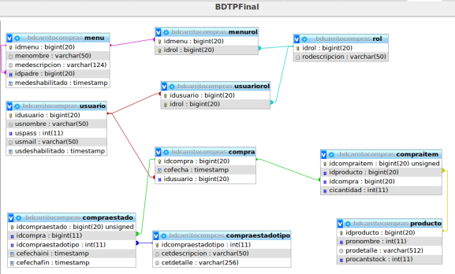
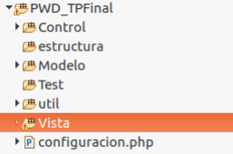

# PWD - Trabajo Práctico Final: Carrito de Compras

## Tabla de contenido

- [Descripción](#descripción-)
  - [Objetivo](#objetivo-)
  - [Pautas Básicas](#pautas-básicas-)
- [Ilustraciones](#ilustraciones-%EF%B8%8F)
- [Mi Procedimiento](#mi-procedimiento-)
  - [Construido con](#construido-con-%EF%B8%8F)
  - [Recursos Útiles](#recursos-útiles-)

## Descripción 📋

- <b>Dominio:</b> Cine
- <b>Productos:</b> Entradas y Consumiciones
- <b>Participantes:</b> [Eugenia Garcia Ruiz](https://github.com/Eugenia-2793) y [Marcos Andrés Travaglini](https://github.com/Blackpachamame)
- <b>Carrera:</b> Tecnicatura Universitaria en Desarrollo Web
- <b>Materia:</b> Programación Web Dinámica
- <b>Año:</b> 2021

### Objetivo 📌

El objetivo del trabajo es integrar los conceptos vistos en la materia. Se espera que el alumno implemente una tienda online que tendrá 2 vistas: una vista “pública” y otra “privada”.
Desde la **vista pública** se tiene acceso a la información de la tienda: dirección, medios de contacto, descripción y toda aquella información que crea importante desplegar. Además, se podrá acceder a la vista privada de la aplicación, a partir del ingreso de un usuario y contraseña válida.
Desde la **vista privada**, luego de concretar el proceso de autenticación y dependiendo los roles con el que cuenta el usuario que ingresa al sistema, se van a poder realizar diferentes operaciones. Los roles iniciales son: _cliente, depósito y administrador._

### Pautas Básicas 📏

1. La aplicación debe ser desarrollada sobre una arquitectura MVC (Modelo-Vista-Control) utilizando PHP como lenguaje de programación. Se propone una estructura de directorio inicial como la que se visualiza en la [Ilustración 2](#modelo-entidad-relación).
2. Se debe utilizar la Base de Datos **_bdcarritocompras_** otorgada por la cátedra. Realizar el MOR de las tablas del modelo de base de datos de la [Ilustración 1](#estructura-proyecto). Verificar la estructura de las tablas y realizar las modificaciones que crea necesarias.
3. La aplicación tendrá páginas públicas y otras restringidas, que sólo podrán ser accedidas a partir de un usuario y contraseña. Utilizar el módulo de autenticación implementado en TP5. La aplicación debe tener como mínimo los siguientes roles: cliente, depósito y administrador.
4. El menú de la aplicación debe ser un menú dinámico que pueda ser gestionado por el administrador de la aplicación. Las tablas de la base de datos vinculadas a esta información son: menu y menurol.
5. Cualquier usuario que tenga más de un rol asignado, puede cambiar de rol según lo desee.
6. Desde la aplicación un usuario con rol **_Cliente_** podrá:
   1. Gestionar los datos de su cuenta, como cambiar su e-mail y contraseña.
   2. Realizar la compra de uno o más productos con stock suficiente.
7. Desde la aplicación un usuario con rol **_Depósito_** podrá:
   1. Crear nuevos productos y administrar los existentes.
   2. Acceder a los procedimientos que permite el cambio de estado de los productos.
   3. Modificar el stock de los productos.
8. Desde la aplicación un usuario con rol **_Administrador_** podrá:
   1. Crear nuevos usuarios al sistema, asignar los roles correspondientes y actualizar la información que se requiera.
   2. Gestionar y administrar nuevos roles e ítem del menú. Vinculando ítem del menú al rol según corresponda.

## Ilustraciones 🖼️

### Modelo Entidad Relación

### Estructura Proyecto

## Mi Procedimiento 👣

### Construido con 🛠️

- HTML5
- CSS3
- AJAX
- Bootstrap 5
- PHP
- Visual Studio Code

### Recursos Útiles 👈

- [Documentación de Bootstrap](https://getbootstrap.com/docs/5.0/getting-started/introduction/)
